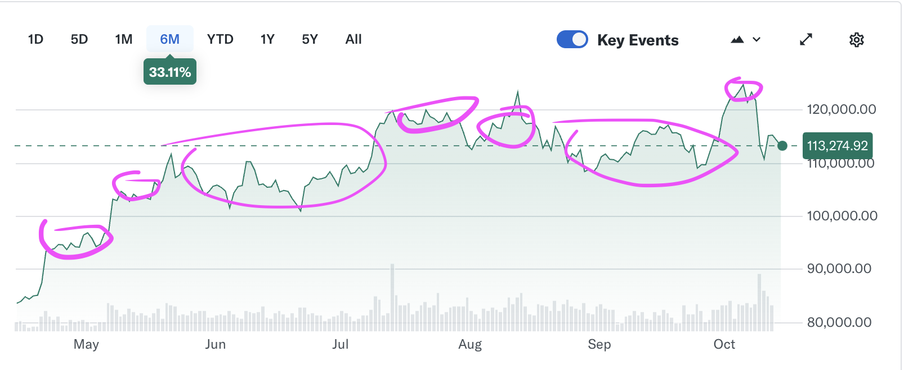

# Algorithmic Trading AI with Python

## Usage Guide Training and Testing

Install Dependencies

```bash
pip install -r requirements.txt
```

## HuggingFace Hub Login

For the Gemma Embedding model, you need to login to HuggingFace Hub

```
hf auth login
```

Model trains on 80% of data, tests on 20% of data.

```bash
python download.py ## (OPTIONAL) Download New Data
python train.py    ## (OPTIONAL) Re-Train the model
python test.py     ## Test the model ( recommend modify parameters in the script )
```

> 💡 The model is already trained, so running `train.py` is optional.
> Find the trained model saved as `gemma_transformer_classifier.pth`

## To Profit from the model, probabaly??!?!?
In order to use the model, copy `test.py` to `profit.py`
and modiy it to use Yfinance websocket data stream.
https://ranaroussi.github.io/yfinance/reference/yfinance.websocket.html
When a price signal is generated, load news (see download.py)
process the data the same way in `test.py` and get the model output.

> ⚠️  Be carful, this is not financial advice, and the model is not guaranteed to be profitable.

## Tuning and Optimization
 - ✅ Save and load model
 - ✅ Calcluate the Cost
 - ✅ Separate training and validation data
 - ✅ More data again!
 - ✅ SGD
 - ✅ Activations
 - ✅ More DATA!
     - ✅ More Data ( pull in from download.py)
     - ✅
 - Capture median price % deltas and use that as market indicator
 - Reinforcement learning
 - Reduce dimentionality of embeddings
 - Change input data add more Symbols
 - Labels threshold changes ( reduce from 0.1% to 0.05% )
 - Batch Size
     - Multi-stage Batch Training
 - Dropout Rate
 - Learning Rate
 - More Input
    - Time of day (vectorize, day of week )
 - Learning rate adjustments
 - Sequence Data ( merge sequences together )
 - Embedding Cacheing ( save embeddings hash )
 - ~~Instead of Gemma UniformScalar + NLP Embedding~~

## Target Market Pattern
 - Volatile Market
 - Lots of news events 
 - High volume



## Libraries
 - Yfinance (datasource)
 - Pytorch Transformer 
 - Gemma embedding 300m GOOGLE 
 - Numpy
 - matplotlib
 - Pandas
 - Scikit-learn

## Target Symbol
 - BTC-USD (Bitcoin to US Dollar)
 - AAPL (Apple Inc.)
 - TSLA (Tesla Inc.)
 - GC=F (Gold Futures)

## Inputs and outputs

### Input data
 - Historical price data 
 - News headlines sentiment will be derived
 - Foreign policy events

### Outputs
 - Sell/Hold/Buy signals

## Model
 - Gemma Embedding (300m parameters)
 - Pytorch Transformer
 - Classification Layer ([3] output)

## Training
 - Supervised learning
 - Reinforcement learning

### Input Data Format 

Sorted by date, descending.

```
Prices: list of prices
Headline: list of news headlines
```

```
Prices: 10.0,11.0,14.0,8.0,10.0,5.0
Headline: Sector Update: Financial Stocks Rise Tuesday Afternoon

Prices: 10.0,11.0,14.0,8.0,10.0,5.0
Headline: Sector Update: Financial Stocks Rise Tuesday Afternoon

Prices: 10.0,11.0,14.0,8.0,10.0,5.0
Headline: Sector Update: Financial Stocks Rise Tuesday Afternoon
```
### Ouptput Data Format
Sell/Hold/Buy signals
[0,   0,   0 ]

Sell = [1, 0, 0]
Hold = [0, 1, 0]
Buy  = [0, 0, 1]

### Limit Triggers Indications
- Average up and down cycles
- 1% limit triggers 100 gain 1 dollar 101
- time window is 5 minutes
